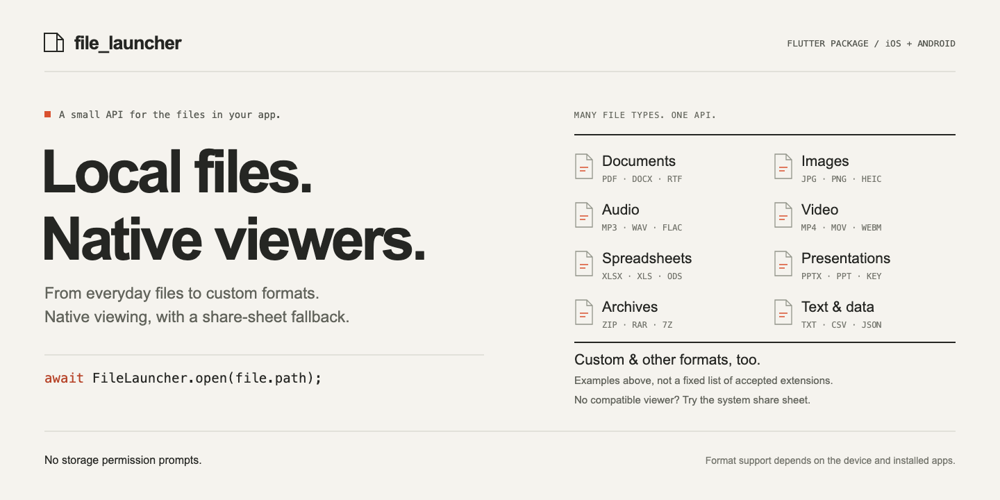
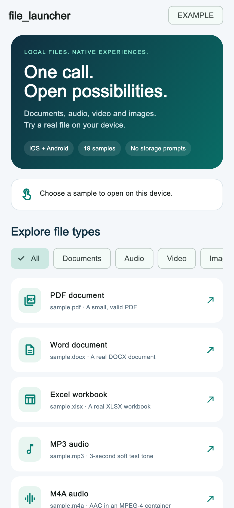

<p align="center">
  
  
  
</p>

**Give local files a natural next step.** Open an invoice, listen to a recording, watch a clip or view a document using the device’s native UI—with a system share sheet when no viewer is available.

```dart
final result = await FileLauncher.open(file.path);
```

[Get started](#get-started) · [File types](#what-can-i-open) · [Try the gallery](#try-the-file-gallery) · [Results](#know-what-happened) · [Platform notes](doc/platform_notes.md)

## Small API. Useful details.

| 📄 Open naturally | 🎧 Bring your media | ↗ Keep a fallback |
| --- | --- | --- |
| Quick Look inside your iOS app. Installed native viewers on Android. | PDF, audio, video, images, Office documents and more. | A system share sheet when a viewer cannot be found. |

| 🔐 No storage prompts | 📱 Built for mobile | ✓ Know the outcome |
| --- | --- | --- |
| Share app-readable files using narrowly scoped, read-only Android URI grants. | Scene-aware iOS presentation and anchored iPad share popovers. | Clear result statuses. No waiting for the user to dismiss a viewer. |

> **Development preview · 0.1.0.** Builds and automated checks are passing; the physical-device acceptance matrix is still pending. This is a native launcher: actual rendering and playback depend on the OS, installed viewer, file contents and codec.

## Get started

Until the package is published, point your app at this local checkout:

```yaml
dependencies:
  file_launcher:
    path: ../file_launcher
```

Import, open, and handle the result:

```dart
import 'package:file_launcher/file_launcher.dart';

final result = await FileLauncher.open(
  invoice.path,                 // Absolute path to a readable local file.
  title: 'Your invoice',        // Optional: iOS preview title.
);

if (!result.isSuccess) {
  // Show a message, retry later, or download the file again.
  debugPrint('${result.status.name}: ${result.message}');
}
```

**Requirements:** Flutter 3.44+, Dart 3.12+, Android API 24+. The iOS plugin declares iOS 13+; the example targets iOS 15 for Xcode 27. Older-iOS runtime verification is pending. CocoaPods and Swift Package Manager definitions are included; SPM has been build-verified. Web and desktop return `unsupportedPlatform`.

## What can I open?

Pass a file your app can already read. Common Android MIME types are mapped explicitly so filenames route consistently across OS versions. Other extensions use Android’s system lookup.

| File family | Example extensions | iOS | Android |
| --- | --- | --- | --- |
| **PDF** | `pdf` | Quick Look preview when supported | Installed PDF viewer |
| **Audio** | `mp3` `m4a` `wav` `aac` `flac` `ogg` `opus` | Quick Look playback for supported formats/codecs | Installed audio player |
| **Video** | `mp4` `mov` `m4v` `webm` `mkv` | Quick Look playback for supported formats/codecs | Installed video player |
| **Images** | `jpg` `png` `gif` `webp` `heic` `svg` | Quick Look when supported | Installed image viewer |
| **Office** | `docx` `xlsx` `pptx` `doc` `xls` `ppt` | Quick Look when supported | Compatible document app |
| **Text & data** | `txt` `csv` `json` `xml` `md` `rtf` | Quick Look when supported | Compatible text/data app |
| **Other formats** | `zip` `epub` `vcf` `ics` `usdz` | Runtime Quick Look check, then share | Compatible app, then share |
| **Unknown / custom** | Any other extension | Preview if recognized; otherwise share | System type lookup, then generic launch/share |

**When no viewer is available, the plugin tries the system share sheet.** Listing an extension means it can be handed to the OS; it does not promise a decoder or installed app. A corrupt, password-protected or unsupported file can still be rejected by the viewer after launch. See [Apple Quick Look](https://developer.apple.com/documentation/quicklook/) and [Android media formats](https://developer.android.com/media/platform/supported-formats) for platform context; an external Android player may support different codecs. APK installation is intentionally unsupported.

### Open a PDF

```dart
await FileLauncher.open('/absolute/path/invoice.pdf', title: 'Invoice');
```

### Open audio or video

```dart
await FileLauncher.open('/absolute/path/recording.mp3');
await FileLauncher.open('/absolute/path/voice-note.m4a');
await FileLauncher.open('/absolute/path/clip.mp4');
```

The device supplies the player and playback controls. The returned result describes launching the viewer, not whether playback finished.

### Downloaded a file without an extension?

Prefer saving it with its real extension on **both platforms**. If that is not possible, supply an Android MIME override:

```dart
await FileLauncher.open(
  '/absolute/path/download',
  mimeType: 'application/pdf', // Android only.
);
```

Use a `type/subtype`, such as `audio/mpeg` or `application/pdf`. Surrounding whitespace and case are normalized on Android; malformed MIME overrides return `error`. On iOS the extension still matters, and `mimeType` is ignored.

## Try the file gallery

A small, categorized demo makes it easy to explore the native behavior yourself.



**19 real bundled samples:** PDF, DOCX, XLSX, seven audio formats, MP4, PNG, JPEG, TXT, CSV, JSON, ZIP, an unknown type and an extensionless PDF. Audio fixtures contain a three-second soft test tone.

```sh
cd example
flutter run
```

Choose **Audio** to try the players, or **Other** to explore the fallback. Each launch reports its status and elapsed time. Close the native screen before trying another sample. The image above shows the Flutter gallery; native viewer screens vary by device.

## Know what happened

`FileLauncher.open()` returns `OpenFileResult` instead of throwing.

| Result | What it means | Typical next step |
| --- | --- | --- |
| `done` | iOS presented a preview, or Android accepted a viewer launch | Let the user continue |
| `shareSheet` | The system accepted a share-sheet launch | Let the user choose a destination |
| `fileNotFound` | The path is missing or is a directory | Download or locate the file again |
| `noAppToOpen` | Android could not launch a viewer or even a chooser | Suggest a compatible app |
| `noViewController` | iOS has no active screen to present on | Retry when the app is visible |
| `unsupportedPlatform` | This platform is not implemented | Hide or replace the open action |
| `error` | Invalid input, unreadable file, busy presentation or another failure | Inspect `message` |

`isSuccess` is true for `done` and `shareSheet`. Android may show an empty chooser if no receiving apps are installed; it cannot confirm that another app displayed the file. Neither success status means the user saved, read or played the file.

## A few things to know

- **Local paths only.** Copy picker/download results to an app-readable file. URLs, `content://` strings, relative paths and directories are not file-path inputs.
- **Keep the real extension.** Names such as `invoice.pdf` and `recording.m4a` help native viewers identify files correctly.
- **Open while foregrounded.** Close the previous iOS preview before opening another. Calls during UI transitions can return an error to retry.
- **Android stages a cache copy.** Large files take time and disk space. Copies are retained for up to seven days until a later call cleans them; the OS may evict them earlier. Originals are not changed.
- **No permission setup.** The plugin declares no storage, installation or broad package-query permissions, and needs no iOS Info.plist keys.

[Read the platform and cache details →](doc/platform_notes.md)

## Moving from another opener?

```dart
// Before: OpenFile.open(path) or OpenFilex.open(path)
final result = await FileLauncher.open(path);
if (result.isSuccess) {
  // A viewer or share sheet was launched.
}
```

Use `mimeType` for Android type overrides and `result.status` for failure handling. Remove old provider overrides only if nothing else uses them. [Migration and platform details →](doc/platform_notes.md#migration-from-open_file--open_filex--open_file_plus)

## Validation & contributing

The repo includes Dart tests, example tests, native Android routing tests, an iOS test target, and CI build checks. The Android tests verify PDF/audio MIME routing, URI read grants and share fallback; they do not substitute for seeing and hearing files on real devices.

See [TESTING.md](TESTING.md) for the acceptance matrix and recorded local results. Run `flutter analyze` and `flutter test` from the package, then `flutter test` from `example`. Release requires physical-device checks, repository metadata and publication review.

[MIT licensed](LICENSE). Built with Flutter, Android intents and [Apple Quick Look](https://developer.apple.com/documentation/quicklook/).
